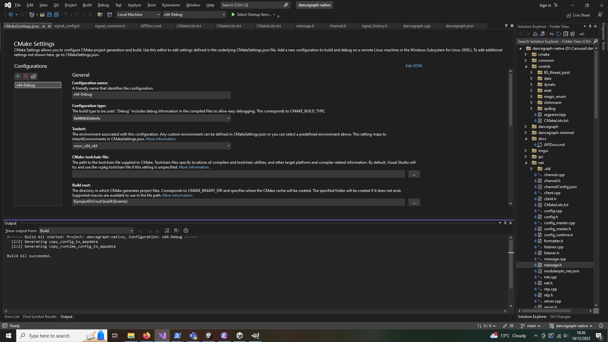
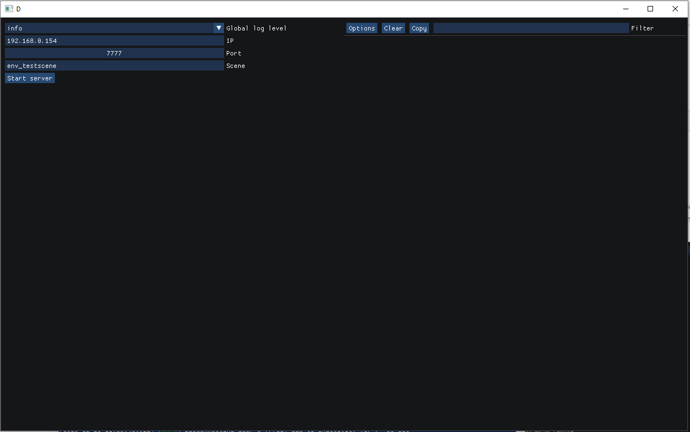

<h2 align="center">DanceGraph</h2>
<p align="center">DanceGraph is a low-latency engine agnostic interactive avatar platform for dancing and having fun online. It is provided as an open source toolset from the <a href="https://carouseldancing.org">CAROUSEL+</a> EU funded FET PROACT project #101017779</p>
<div align="center">

[](https://discord.gg/eMcjUHN8rQ)
[](https://twitter.com/CarouselDancing)
[](https://www.youtube.com/channel/UCz2rCoDtFlJ4K1yOExu0AWQ?sub_confirmation=1)
[](https://github.com/CarouselDancing/dancegraph/stargazers)
[](https://github.com/CarouselDancing/dancegraph/graphs/commit-activity)
[](CODE_OF_CONDUCT.md)
[](https://vscode.dev/github/CarouselDancing/dancegraph)
[](https://github.com/CarouselDancing/dancegraph/releases)
[]()

</div>

## Overview

DanceGraph provides an application for *as-direct-as-possible* low-latency network signal transportation, specifically with referencing to ameliorating the latency issues with online dancing. It aims to provide as-direct-as-possible transport between the incoming network signals and the resulting visual output, as well as providing facilities for short-term latency prediction.

As far as possible, the architecture decouples the generation and handling of signal data, by the use of 'producers', which create signals, and 'consumers' which receive them. This allows for some producers and consumers to be written in a signal-agnostic fashion.

Transformers, which take a number of signals as consumer-style input and produce a new or altered signal, are an upcoming feature.

Currently, development is taking place with DanceGraph implemented as a Unity plugin, but the code has been written to support DanceGraph's use as a standalone executable when entirely decoupled from the engine, with only a stub plugin used to communicate with the standalone client via IPC producers and consumers.

## 1. Installing and Running

### Core External Dependencies

[](https://www.microsoft.com/software-download/windows11)
[](https://en.cppreference.com/w/cpp/20)
[](https://git-scm.com/download/win)
[](https://visualstudio.microsoft.com/vs/community/)

### Dance Application Dependencies

[](https://img.shields.io/github/v/release/stereolabs/zed-sdk?color=%2300aeec&label=ZED%20SDK)
[](https://developer.nvidia.com/cuda-downloads?target_os=Windows&target_arch=x86_64)
[](https://download.unity3d.com/download_unity/9674261d40ee/Windows64EditorInstaller/UnitySetup64-2022.3.5f1.exe)

### Other Dependencies

[](https://badge.fury.io/py/nine)

### Hardware Dependencies

[](https://store.stereolabs.com/products/zed-2)
[]()

### Dependencies in contrib

|Lib|License|Repo|
|-|-|-|
|Dear Imgui | [](https://opensource.org/licenses/MIT) | <https://www.dearimgui.org/> |
| argparse | [](https://opensource.org/licenses/MIT) | <http://github.com/p-ranav/argparse> |
| date |  [](https://opensource.org/licenses/MIT)| <https://github.com/HowardHinnant/date> |
| dynalo | [](https://opensource.org/licenses/MIT) | <https://github.com/maddouri/dynalo> |
| enet | [](https://opensource.org/licenses/MIT) | <http://enet.bespin.org/> |
| fmt | [](https://opensource.org/licenses/MIT)[*](https://github.com/fmtlib/fmt/blob/master/LICENSE) | <https://github.com/fmtlib/fmt> |
| nlohmann::json | [](https://opensource.org/licenses/MIT) | <https://json.nlohmann.me/> |
| magic_enum | [](https://opensource.org/licenses/MIT) | <https://github.com/Neargye/magic_enum> |
| ntp | [WTFPL](https://github.com/parezj/NTP-Client?tab=WTFPL-1-ov-file) | <https://github.com/parezj/NTP-Client> |
| BS_thread_pool | [](https://opensource.org/licenses/MIT) | <https://github.com/bshoshany/thread-pool> |
| spdlog | [](https://opensource.org/licenses/MIT) | <https://github.com/gabime/spdlog> |

### Downloading and building the native repo

Install the ZED SDK

If using the command line (otherwise refer to your git client documentation)

    git clone --recursive git@github.com:CarouselDancing/dancegraph.git

or

    git clone --recursive https://github.com/CarouselDancing/dancegraph

The recursive clone pulls spdlog and BS_thread_pool from other git repos.

Load the project using Visual Studio (either using cmake OR VS22's inbuilt cmake support)

The ZED SDK breaks if you try compiling in debug mode; instead, from the Visual Studio menu bar, go to Project/cmake settings for dancegraph and in the 'Configuration type' select RelWithDebInfo

#### [OPTIONAL] Installing the native repo without ZED Camera support

It's possible to compile DanceGraph without requiring the ZED Camera SDK and dependencies
This will mean that you will not be able to use a ZED Camera. To use this, invoke CMAKE with the option

    -DUSE_ZED_SDK=OFF

(In Visual Studio 22, add this to the CMake command arguments section of the CMakeSettings.json file; for the command line cmake client, place this before the path to the top level CMakeLists.txt file. For other CMake clients, consult your documentation)



From VS's menu bar, Build/Build all should build the entire project, and install the dlls and the two native config files in %LOCALAPPDATA%/DanceGraph

### Downloading and building the Unity repo

Install Unity Hub

Then clone the unity repo, e.g. with

    git clone git@github.com:CarouselDancing/dancegraph-unity.git

or

    git clone https://github.com/CarouselDancing/dancegraph-unity

Using Unity hub to start the project using 'Add project from disk'

Install the correct Unity version for the project (as at time of writing, 2022.3.5f1)

### Creating a server

The easiest way to create a server after compiling the project is to launch './server-gui.exe', and populate the 'log level', 'IP', 'port' and 'scene' fields before clicking the 'start_server' button; the 'scene' field is one of those in dancegraph.json, with 'env_testscene' being recommended.



The command line nettest.exe utility can also be used to run a server, via './nettest.exe --mode server env_test'.

### Editing the client settings

The settings.json file contains a number of configuration settings that might warrant tweaking.

In the "preset" section, you will find the desired username, the "scene", which should match that of the server, the "role" (which should be one of the roles in the "scene" section of dancegraph.json", and the server and client IP addresses, which should match those of your networking setup.

```json
    "username": "Fred",
    "scene": "env_testscene",
    "role": "dancer",
    "address": {
      "ip": "192.168.0.154",
      "port": 7800
    },
    "server_address": {
      "ip": "192.168.0.154",
      "port": 7777
    },
```

Optionally, the signal producer can be edited; (in the case below, it's been altered to produce a tpose skeleton rather than a pose from a zed camera), and consumers can be added or removed; in the below case, a consumer has been added to dump signal data to a file in the top level Unity hierarchy

```json
    "producer_overrides": {
      "zed/v2.1": {
        "name": "tpose"
      },
      "env/v1.0": {
        "name": "generic/prod_ipc/v1.0",
        "opts": {
          "ipcInBufferName": "DanceGraph_Env_In",
          "ipcBufferEntries": 5
        }
      }
    },
    "user_signal_consumers": {
      "zed/v2.1": [
        {
          "name": "generic/dump2file/v1.0",
          "opts": {
          }
        }
      ]
    },
```

### Launching a client

The Unity client's configuration is primarily inside the settings.json, found in Assets/StreamingAssets in the Unity repository. Here, the address of the server as well as the local IP port can be found. The address, server_address and producer_overrides fields are the most important.

### VR Headsets

The Oculus Quest 2 headset is the main headset for the dancegraph project. Other headsets may work, but are not supported.

Powering on the headset and putting it in in Air Link (via wifi) or Quest Link mode (using the supplied cable) and then starting the unity project should be enough to have the user's headset view from inside the gameworld. Note that the Quest 2 drops out of Air Link mode after some idle time.

The joysticks on the Quest controllers can be used to position the user in the same place as their avatar, if the initial placement calculation gets it wrong.

## 2. Writing consumers and producers

### Overview

In DanceGraph, signal input and output is decoupled from each other and separated from the main dancegraph client for the purposes of modularity and code reuse. These modules are implemented as shared library DLLs.

Producers are the signal generation modules. Typically a producer module will take information from a hardware source, such as a camera, or microphone or haptic device. Other signal sources - such as generating synthetic testing signals, or loading recorded signal data from a file - are also implemented as producers.

Consumers are the modules which dispatch signal data. For example, the data can be passed off to a game engine via IPC, or saved to a file. Sending data upstream to the network is implicitly performed by the DanceGraph client and isn't implemented as a consumer. Consumers should preferably be written in a signal-agnostic fashion, though this may not always be possible. A single signal may have multiple consumers attached so that the same tracking signal could be, say, sent to a game engine AND saved to a file AND have a dump printed to stdout simultaneously.

Config modules are modules which set various signal options using the sig::SignalProperties class, and can pass some extra information to the producer/consumers.

Transformers are a forthcoming set of modules intended to morph incoming signals; these are in current development.

When using the dancegraph_minimal dll plugin for unity, the consumption of signals to be read by Unity takes place transparently, without the need for a consumer to handle the incoming signals.

Note that when writing modules, the final spdlog::critical message will get passed to the end user upon a failure. spdlog::critical should be earmarked for messages that users will find useful for diagnosing failures (e.g. passing on details of hardware failures, etc).

### Config DLL Initialization

The first stage in the pipeline is the initialization of the signals by calling the GetSignalProperties function implemented in the signal's configuration dll

    DYNALO_EXPORT void DYNALO_CALL GetSignalProperties(sig::SignalProperties& sigProp); // in config.dll

The primary purpose of this is call is to set the signal size to that of the signal for use by dancegraph and the producer and consumer dlls, typically by calling the *sig::SignalProperties::set_all_sizes(int)* method on the sigProp parameter.

The sigProp parameter also contains a 'jsonConfig' std::string member, which contains options obtained from the master config; some signals may need to parse this to work out the signal size.

### Producer Initialization

After the initialization, the producer dll's SignalProducerInitialize function is called

    DYNALO_EXPORT bool DYNALO_CALL SignalProducerInitialize(const sig::SignalProperties& sigProp); // found in producer dll

This call gives the producer writer an opportunity to perform any initialization steps they consider necessary.

The following line optionally allows logging via spdlog:

    spdlog::set_default_logger(sigProp.logger);

### Consumer Initialization

For every consumer dll attached to the signal, the consumer's SignalConsumerInitialize function is then called, this time with a sig:SignalConsumerRuntimeConfig parameter

 DYNALO_EXPORT bool DYNALO_CALL SignalConsumerInitialize(const sig::SignalProperties& sigProp, sig::SignalConsumerRuntimeConfig& cfg); // in consumer dll

The following line optionally allows logging via spdlog:

    spdlog::set_default_logger(sigProp.logger);

### Producing signals

    DYNALO_EXPORT int DYNALO_CALL GetSignalData(uint8_t* mem, sig::time_point& time); // in consumer dll

GetSignalData is called to allow the producer to write signal data to the memory pointed at by `mem`. The number of bytes written should not exceed the amount set by the signal config dll.

The return value is the number of bytes written to `mem`, if there is no signal to produce, the return value should be 0. A reference timestamp `time` is provided and should be written to with the most pertinent signal generation time for latency calculation (e.g. for a zedcam track, this should be written immedately after the image is grabbed by the camera).

Producer calls take place in their own thread, in order to avoid blocking the main dancegraph loop and DanceGraph will refrain from calling the producer again until after the last GetSignalData call has finished.

### Consuming signals

    DYNALO_EXPORT void DYNALO_CALL ProcessSignalData(const uint8_t* mem, int size, const sig::SignalMetadata& sigMeta); // in producer dll

The ProcessSignalData function is called whenever there is an applicable signal ready to be processed by the consumer.
The signal consists of `size' bytes pointed at by`mem'. Extra information on the origin and type of the signal is provided by the `sigMeta' SignalMetadata parameter.

### Shutdown

After shutdown, Dnancegraph calls shutdown functions for each producer and consumer, to allow module writers to deallocate resources, free memory, and otherwise tidy up.

    DYNALO_EXPORT void DYNALO_CALL SignalConsumerShutdown(); // in consumer dll
    DYNALO_EXPORT void DYNALO_CALL SignalProducerShutdown(); // in producer dll

## 3. Repo Structure

| Directory          | Use                                                                    |
|--------------------|------------------------------------------------------------------------|
| apps               | Executable files, primarily server-gui                                 |
| contrib            | External dependencies                                                  |
| docs               | Documentation                                                          |
| modules            | Consumer/Producer/Transformer modules, grouped by signal type          |
| modules/zed        | Modules for ZED bodytracking                                           |
| modules/mic        | Modules for Mic audio                                                  |
| modules/generic    | Modules that work on multiple signal types                             |
| modules/env        | Environment signal modules                                             |
| modules/impulse    | Test signals                                                           |
| modules/sample     | Stub module code                                                       |
| resources          | Configuration scripts and other resources                              |
| core               | Code for the core DanceGraph client                                    |
| core/common        | Multipurpose utility functions                                         |
| core/ext           | Plugins for external tools, such as Unity                              |
| core/lib           | Various libraries used in the codebase                                 |
| core/lib/ipc       | Inter-process communication ringbuffer                                 |
| core/lib/pubsub    | Publisher/Subscriber module                                            |
| core/lib/net-imgui | Glue code between the IMGUI library and the GUI based apps that use it |
| core/lib/sig       | Signal Library management                                              |
| core/tests         | Source code for test executables                                       |
| core/net           | Main Network Handling code                                             |
| core/scripts       | Developer helper scripts                                               |

## 4. Configuration Reference

Currently there are three configuration files. These are in hand-written json, at the moment, though at some point it will be useful to provide user-friendly configuration tool. Most end users will primarily be editing the settings.json file.

### Unity config: settings.json

This is the settings file containing runtime information for the Unity-side client.
The main portion of the file contains runtime config information passed to the native plugin
The config file is inside the Unity Project, under Assets/StreamingAssets/settings.json

||||
|-|-|-|
| preset                  | object | Runtime config settings to the native client                         |
| autoConnect             | bool   | Automatic server connection                                          |
| logLevel                | int    | How much log info in the unity console. 0 == everything, 7 = nothing |
| logToFileStem           | string | A prefix for the log files                                           |
| simpleSkeletonSmoothing | bool   | Whether to attempt to employ client-side smoothing                   |

#### All configs: DLL configuration object

DLLs for consumers, producers and transformers recur often in the settings.json and dancegraph_rt_presets.json file and have the following structure; collections of these objects are referred to as 'dlls' in subsequent tables

__DLL Config__

|      |        |                                                                             |
|------|--------|-----------------------------------------------------------------------------|
| dll  | string | Name of the dll; the path is %LOCALAPPDATA%/DanceGraph/modles/<dllname>.dll |
| opts | object | An arbitrary json object, typically a series of string : value pairs        |

Here's an example snippet from the current settings.json file

```json
    "prod_ipc": {
        "v1.0": {
            "dll": "producer_ipc",
            "opts": {
                "ipcOutBufferName": "DanceGraph_Generic_In",
                "ipcBufferEntries": 5
            }
        }
    }
```

#### Runtime config options (both native and Unity)

The 'presets' section of the Unity config settings.json contains a bundle of runtime options in the below format. This format is also used for the client presets in the dancegraph_rt_presets file (primarily for use with command line test clients).

__Runtime Presets Config__

|                       |         |                                                                                 |
|-----------------------|---------|---------------------------------------------------------------------------------|
| username              | string  | The user's displayed name                                                       |
| scene                 | string  | the expected set of signals to be set and received, from dancegraph.json        |
| role                  | string  | the role in the 'dancegraph.json' scene                                         |
| address               | object  | The IP and UDP port of the local client                                         |
| server_address        | object  | The IP and UDP port of the server to connect to                                 |
| producer_overrides    | dll     | The signal producer dll object, referenced by signal/version                    |
| env_signal_consumers  | dll     | The consumers of environment signals (dll objects, referenced by signal/version |
| user_signal_consumers | dll     | the consumers of user signals (dll objects, referenced by signal/version)       |
| include_ipc_consumers | boolean | Whether dancegraph is a standalone program or an engine plugin                  |
| single_port_operation | boolean | Suppress use of multiple UDP ports                                              |
| ignore_ntp            | boolean | Whether to avoid calling ntp (avoids timeouts when there's no internet)         |

The 'address' and 'server' address objects follow the same straightforward format

__Address Config__

|         |        |                            |
|---------|--------|----------------------------|
| address | string | The IP address             |
| port    | int    | The UDP port to connect to |

### Master Config (dancegraph.json)

The main native dancegraph config file is resources/dancegraph.json which contains the core definitions of the signal types, as well as the reference names for the various producer and consumer dlls
It is copied into %LOCALAPPDATA% at build time.

|                   |        |                                           |
|-------------------|--------|-------------------------------------------|
| dll-folder        | string | folder containing dlls                    |
| networking        | object | networking options                        |
| scenes            | object | signal configuration                      |
| generic_producers | dlls   | config for non-signal-specific producers  |
| generic_consumers | dlls   | config for non-signal-specific consumers  |
| transformers      | dlls   | transformer config                        |
| user_signals      | object | producer/consumer config for signal types |
| env_signals       | object | config for environment signal dlls        |

The networking section currently contains a single integer value which is the time before a server connection attempt fails in seconds

__networking object__

|                   |     |         |
|-------------------|-----|---------|
| connectionTimeout | int | Time to |

#### Master Config: 'scenes' object

The 'scenes' object is an object of signal configuration sets indexed by scene-name, such as

```json
    "env_testscene": {
        "env_signals": [ "env/v1.0" ],
        "user_roles": {
            "dancer": {
                "user_signals": [ { "name": "zed/v2.1" } ]
            }
    }
```

This field demarcates the signal types that a server and client are expected to be able to handle.
Clients will be aligned with certain roles, which each are assigned a subset of user signals.

|             |        |                      |
|-------------|--------|----------------------|
| env_signals | list   | list of signal names |
| user_roles  | object | list of roles        |

#### Generic producers/consumers

Some producers and consumers can be written in a signal-agnostic manner and can be applied to multiple signal types. These show up in the configuration file under 'generic_producers' and 'generic_consumers' indexed by name and version.

#### user_signals and env_signals

|            |        |                                          |
|------------|--------|------------------------------------------|
| opts       | object | default signal options                   |
| globalopts | object | more default options (unused)            |
| config     | dll    | location of the signal config dll        |
| producers  | dll    | location of various signal producer dlls |
| consumers  | dll    | location of various signal consumer dlls |

In the source tree, this is in the resources directory of the native repository and is migrated to %LOCALAPPDATA%/DanceGraph at build, or install, time

### Runtime config: dancegraph_rt_presets.json

The resources/dancegraph_rt_presets.json file  contains a bundle of named runtime settings primarily intended for use by the server, and for testing using the command-line test clients, such as nettest.exe.

The runtime settings format for clients and listeners is the same as the 'presets' object in settings.json, but these are indexed by named keys. Typically, these are for the nettest.exe command line tool.

The dancegraph_rt_presets.json file is copied into %LOCALAPPDATA% at build time.

|        |                |                         |
|--------|----------------|-------------------------|
| client | runtime preset | client runtime settings |
| server | object         | server runtime settings |

The 'client' object uses the same format as that of the 'Runtime config options' section above.
The 'server' object has the following format

|            |         |                                                                          |
|------------|---------|--------------------------------------------------------------------------|
| scene      | string  | list of signals and roles from the 'scenes' section of the master config |
| address    | address | IP and port address of the server                                        |
| ignore_ntp | bool    | Avoid NTP server connections                                             |

## Signals

There are currently three main types of signal handled by DanceGraph.

User signals and environment signals are versioned, and are referenced as "\{name\}/v\{version number\}". In some json contexts, such as dancegraph.json's registry of dlls, the name and version number are split into nested keys, as in:

```json
    "env_signals": {
      "env": {
       "v1.0": {
        "config": {
         "dll": "env_config"
        },
        "opts": {
         "ipcOutBufferName": "DanceGraph_Env_Out",
         "ipcBufferEntries": 5
        },
        "producers": {
         "default": {
          "dll": "prod_ipc"
                            
                            ... etc ...
        }
       }
      }
     }
```

### Control

Control signals are reliable signals which change the state of the network. These include signals for connection and disconnection, for latency measurement and telemetry

| __Signal__                    | __Dir__ | __Description__                                           |
|-------------------------------|---------|-----------------------------------------------------------|
| NewConnection                 | C->S    | Initiate a connection                                     |
| ConnectionInfo                | S->C    | Broadcast new connection info from server                 |
| NewListenerConnection         | L->S    | Send from a newly-connected listener client to the server |
| NewListenerConnectionResponse | S->L    | Server -> listener, straight after connection request     |
| LatencyTelemetry              | S<->C   | For syncing purposes                                      |
| Delay                         | S<->C   | to inform them of their latency to the server             |
| PortOverrideInformation       | C->S    | to inform server of the client's desired port             |
| TelemetryRequest              | S->C    | so that client(s) share their captured telemetry data     |
| TelemetryClientData           | C->S    | info about the client itself and the signals it produces  |
| TelemetryOtherClientData      | C->S    | info about all the client sees                            |
| RegisterSignal                |         | Currently Unused                                          |

### Environment signals

Environment signals change the global state of the gameworld. These are reliable, low-bandwidth signals that update the user avatar's appearance or username, the root gameworld position of the user (i.e. the origin transform of the zedcam's coordinate system relative to the gameworld's coordinate system), the state of the music or the Unity scene information.

Currently, the implementation is geared towards having these signals be bundles of all the relevant state, which are re-sent as necessary (e.g. when music is toggled on or off, the entire state of the gameworld's music is relayed to all users, rather than an individual toggle statement). This allows the server to just store the latest bundle of a given state type and relay it to users on request, or when a new user joins.

Currently the environment states are in flux and subject to change

__SceneState (one global instance)__

|           |        |                                 |
|-----------|--------|---------------------------------|
| sceneName | string | Name of the current Unity scene |

__MusicState (one global instance)__

|           |        |                                        |
|-----------|--------|----------------------------------------|
| trackName | string | Name of the current music track        |
| musicTime | ulong  | timestamp of the music track in ms     |
| isPlaying | bool   | Whether the music is currently playing |

__UserState (one instance per client)__

|             |          |                                                            |
|-------------|----------|------------------------------------------------------------|
| userId      | int      | Client ID of the user                                      |
| userName    | string   | Displayed username                                         |
| avatarDesc  | string   | Details TBD, visual appearance of the avatar               |
| position    | float[3] | Gameworld position of the user's coordinate origin         |
| orientation | short[3] | User coordinate orientation (quantized 48-bit quaternions) |
| isActive    | bool     | Whether the client is active                               |

### User signals

User signals are non-reliable, typically high-bandwidth, signals which carry tracking and microphone audio data between clients. The data is mostly ephemeral (each signal's data is updated every tick so there's no need to ensure reliability)

## 4. Current Consumers and Producers

A brief description of the current roster of consumer and producer dlls

### Generic consumers

#### consumer_dump2file

Saves a given signal to a file, which can then be replayed.

#### consumer_ipc

This takes a signal and sends it to the engine via an almost lock-free, albeit unreliable, IPC shared memory ringbuffer.

#### consumer_printer

Dumps signal values to stdout

### Generic producers

#### producer_ipc

This producer produces a signals receved from an IPC shared memory buffer via an unreliable ringbuffer mechanism .

#### producer_null

This producer produces no signal at all

#### producer_undump

Produces a signal saved from a single-user session. Fixing the undumper to replay multiple user sessions is planned.

### Signal Config dlls

Config dlls have a single function, called at initialization. Their primary purpose is to inform dancegraph of the sizes of the signal in question, but dll authors can use this to perform extra initialization tasks for the signal in question.

### ZED Signals

Signals that are, or simulate body-tracking signals from the ZED 2 camera.

##### zed/v2.1 config

Zed signal configuration involves more settings than most signals, and passes a lot of camera and signal-type information to the producers

#### zed/v2.1 zed4_producer

Produces a signal from a working zed camera

#### zed/v2.1 zed4_tpose

Produces a constant t-pose for debugging purposes

#### zed/v2.1 zed4_extrapolate

Work in progress example transformer code

### Microphone Signals

For passing audio between clients

#### mic/v1.0 config

#### mic/v1.0 mic_consumer

#### mic/v1.0 mic_producer

### Impulse signals

Timing test signals

#### impulse/v1.0 consumer

#### impulse/v1.0 producer

### Environment Signals

Environment signal config and producer modules. Obsolescent, since these can be replaced by engine code or generic IPC producers/consumers

#### env/v1.0 config

#### env/v1.0 test_producer

## References

B. Koniaris, D. Sinclair, K. Mitchell: _[DanceMark: An open telemetry framework for latency sensitive real-time networked immersive experiences](https://napier-repository.worktribe.com/output/3492930/dancemark-an-open-telemetry-framework-for-latency-sensitive-real-time-networked-immersive-experiences)_, IEEE VR 2024 OpenVRLab Workshop on Open Access Tools and Libraries for Virtual Reality.

D. Sinclair, A. Ademola, B. Koniaris, K. Mitchell: _[DanceGraph: A Complementary Architecture for Synchronous Dancing Online](https://farpeek.com/DanceGraph.pdf)_, 2023 36th International Computer Animation & Social Agents (CASA) . 
